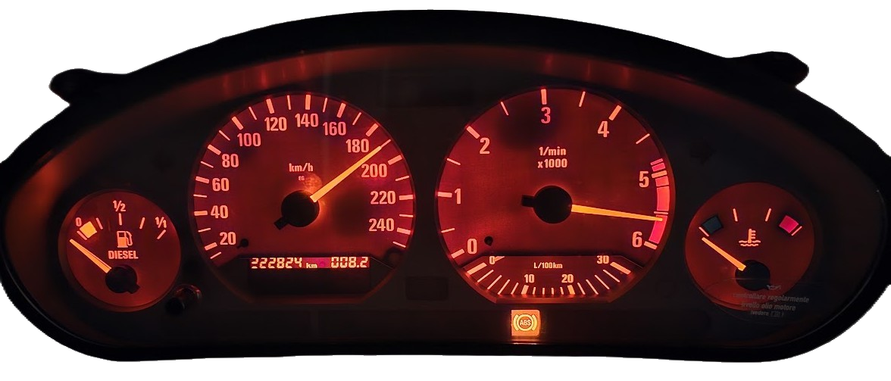

# BMWClusterClock

- 190km/h / 10 = 19 && 5600rpm / 100 = 56  -->  **19:56**
- ESP8266 simulates RPM and SPEED sensors to show time that is recieved via WiFi NTP
- At this point only E36 instrument cluster, in future also E46 (needs additional CAN module)
- Works also with gas clusters or with speed only up to 220 (230 will show normally but it doesn't have the text on the cluster)
### E36
- Connect using [this](https://europe1.discourse-cdn.com/arduino/original/4X/d/a/8/da8ee5492445c1c10ebe42748c3465ddef2f5735.jpeg) pinout, but SPEED pin goes to D5 and RPM pin goes to D6 on ESP8266.
- Open `E36ClusterClock` in Arduino IDE, you may need to comment/uncomment the lookup tables for your cluster or make your own via the `E36Calibrate`, flash, connect to the ESP wifi and enter your home wifi credentials.
### E46
- TBD